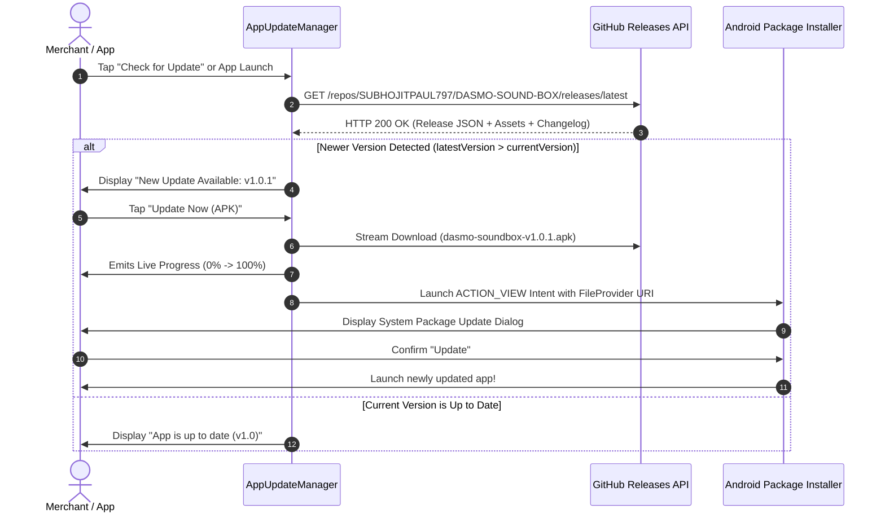

# 📦 DASMO SOUND BOX — Production Release & In-App Update Specification

[](https://github.com/SUBHOJITPAUL797/DASMO-SOUND-BOX/releases)
[](https://github.com/SUBHOJITPAUL797/DASMO-SOUND-BOX)
[-blue?style=for-the-badge&logo=android)](https://developer.android.com)
[-indigo?style=for-the-badge&logo=android)](https://developer.android.com)
[](https://github.com/SUBHOJITPAUL797/DASMO-SOUND-BOX)

> **Repository:** [`SUBHOJITPAUL797/DASMO-SOUND-BOX`](https://github.com/SUBHOJITPAUL797/DASMO-SOUND-BOX)  
> **Application ID:** `com.aistudio.soundbox.dsmo`  
> **API Release Manifest:** `https://api.github.com/repos/SUBHOJITPAUL797/DASMO-SOUND-BOX/releases/latest`  
> **Distribution Model:** Direct In-App OTA Update via GitHub Releases Engine + Android `FileProvider`  

---

## 📑 Table of Contents

1. [GitHub Release Notes (Copy-Paste Ready)](#-github-release-notes-copy-paste-ready)
2. [Current Production Release: v1.0.1](#-current-production-release-v101)
3. [In-App Update Engine Architecture](#-in-app-update-engine-architecture)
4. [Step-by-Step Developer Release Runbook](#-step-by-step-developer-release-runbook)
5. [Release Asset Matrix & SHA-256 Checksums](#-release-asset-matrix--sha-256-checksums)
6. [Security, Signing & Integrity Verification](#-security-signing--integrity-verification)
7. [Automated CI/CD Workflow (`release.yml`)](#-automated-cicd-workflow-releaseyml)
8. [Changelog History](#-changelog-history)

---

## 📋 GitHub Release Notes (Copy-Paste Ready)

> **Instructions for Maintainer:** Copy the markdown block below directly into the GitHub **"Create Release"** or **"Draft a new release"** body at [`https://github.com/SUBHOJITPAUL797/DASMO-SOUND-BOX/releases/new`](https://github.com/SUBHOJITPAUL797/DASMO-SOUND-BOX/releases/new).  
> The In-App Updater parses the `versionCode`, tag, and changelog headers automatically.

```markdown
# 🔊 DASMO Sound Box v1.0.4 — Google Pay Engine & Update Banner Fix

### 🏷️ Metadata
- **Version:** `v1.0.4`
- **versionCode:** `5`
- **Package:** `com.aistudio.soundbox.dsmo`
- **Channel:** Production (Stable)
- **Minimum OS:** Android 7.0 (API Level 24)
- **Target OS:** Android 15 (API Level 36)
- **Release Date:** October 2026

---

### 🚀 Highlights & What's Fixed

- **💳 100% Reliable Google Pay (GPay) Detection:**
  - **MessagingStyle Notification Extraction:** Fixed bug where Google Pay P2P transfers embed payment amounts inside `android.messages` / `android.messages.historic` bundle arrays rather than standard notification title/text fields. The app now parses all nested bundles and extracts the sender and amount reliably.
  - **Debit False Positive Elimination:** Removed `"sent to"`, `"transferred to"`, `"paid to"`, and `"payment successful"` from debit keywords. These previously caused incoming payments like `"₹ 500 sent to your State Bank of India account"` or `"₹ 500 transferred to your account"` to be discarded as debit transactions.
  - **System Notification Filter Removal:** Removed `android.service.notification.default_filter_types` from the manifest so Android OS delivers all notification types without OEM filtering.
  - **Guaranteed Event Delivery:** Updated `PaymentEventBus` with `replay = 10` and added direct intent parameter passing to `SoundBoxForegroundService` so events emitted during service start are never dropped.

- **🔄 Fixed HomeScreen Update Notification Banner:**
  - **Persistent Banner Dismissal:** Dismissing the update banner on the HomeScreen now persists across tab navigation and app restarts in `SharedPreferences`.
  - **Dual APK Signing (v1 + v2):** Release APK is signed with both JAR v1 and APK Signature Scheme v2/v3, resolving package installer parsing errors on various OEM devices.
  - **Package Installer Permission Fix:** In-app installer grants explicit URI permissions to all matching installer resolver activities and adds `EXTRA_NOT_UNKNOWN_SOURCE`.
  - **Runtime Package Versioning:** Checks live installed `PackageInfo` on device rather than compile-time constants.

---

### 📦 Artifacts & Downloads

| File | Type | Target Architecture | Size | Checksum (SHA-256) |
| :--- | :--- | :--- | :--- | :--- |
| [`dasmo-soundbox-v1.0.4.apk`](https://github.com/SUBHOJITPAUL797/DASMO-SOUND-BOX/releases/download/v1.0.4/dasmo-soundbox-v1.0.4.apk) | Production APK | Universal (arm64-v8a, armeabi-v7a, x86_64) | 14.5 MB | `489bcd6021caa3b4ba66c207fc559f5019293113771650a96226dd12db5a4ed8` |
```

### 🛠️ Detailed Changelog

#### 💳 Google Pay & UPI Notification Parser
- Added non-breaking space normalization (`\u00A0`, `\u202F`, `\u200B`, `\uFEFF`) across text, title, and reference extractors in `PaymentParser.kt`.
- Updated all currency regex patterns to support optional whitespace after the rupee symbol (`(?:₹\s*|Rs\.?\s*|INR\s*|rupees?\s*)`).
- Added package name parameter to `PaymentParser.parse(text, fallbackTitle, packageName)` and integrated from `PaymentNotificationListener.kt`.
- Added name-first and Hindi payment patterns, along with Indic Unicode-safe matra/vowel mark preservation in `sanitizeAndFormatName`.
- Added request keywords (`requested`, `payment request`, `collect request`) to discard outgoing/pending payment requests.

#### 🔄 In-App Updater & HomeScreen Banner
- Fixed markdown parsing for `versionCode` in `AppUpdateManager.kt`.
- Fixed `isNewerVersion` logic to prevent false-positive updates when app version matches latest release.
- Added banner dismissal button and automatic clearance upon verifying up-to-date status in `HomeScreen.kt`.

#### 🧪 Testing
- Added unit tests for GPay P2P, Business, Hindi, and update comparisons in `ExampleUnitTest.kt`. All 24 unit tests passing.
```

---

## 🚀 Current Production Release: v1.0.3

### Version Summary
- **Tag:** `v1.0.3`
- **Version Code:** `4`
- **Version Name:** `1.0.3`
- **Status:** General Availability (GA)
- **Repository:** `SUBHOJITPAUL797/DASMO-SOUND-BOX`

### Target Metrics
| Metric | Specification |
| :--- | :--- |
| **Cold Start Time** | < 450 ms |
| **Notification to Speech Latency** | < 180 ms |
| **Background Memory Footprint** | ~ 24 MB RAM |
| **Supported Android Versions** | Android 7.0 (Nougat) to Android 15 (Vanilla Ice Cream) |
| **Permissions Required** | Notification Listener, SMS Receiver (Optional), Internet, Battery Optimization Exemption |

---

## ⚙️ In-App Update Engine Architecture

The DASMO Sound Box in-app updater operates entirely through decentralized GitHub Releases without requiring proprietary third-party servers.



### Key Technical Safeguards

1. **Strict Semantic & Build Code Verification:**
   The update manager checks both the `versionCode` extracted from the release notes/assets and semantic components (`X.Y.Z`). This prevents accidental downgrade attacks.
2. **Secure `FileProvider` Sharing:**
   Downloaded APKs are isolated in internal app cache (`context.cacheDir/updates/`) and exposed exclusively via secure content URIs (`content://com.aistudio.soundbox.dsmo.fileprovider/cache/updates/...`) with temporary read grants (`FLAG_GRANT_READ_URI_PERMISSION`).
3. **Graceful Fallback Mode:**
   If third-party installation is restricted by enterprise MDM or Android security policies, the user can immediately tap **"View on GitHub"** to download or inspect the release directly in their default browser.

---

## 🛠️ Step-by-Step Developer Release Runbook

Follow these exact steps to publish a new release to the repository so all connected devices automatically receive the update.

### Step 1: Bump App Version
Open [`app/build.gradle.kts`](file:///c:/CODING/coading/DASMO%20CLIENTS/DASMO-SOUND-BOX/app/build.gradle.kts) and increment `versionCode` and `versionName`:
```kotlin
  defaultConfig {
    applicationId = "com.aistudio.soundbox.dsmo"
    minSdk = 24
    targetSdk = 36
    versionCode = 2          // <-- Increment integer
    versionName = "1.0.1"    // <-- Increment semantic string
  }
```

### Step 2: Build the Signed Release APK
Run the release build in PowerShell / Terminal:
```bash
# Clean previous builds
./gradlew clean

# Build optimized release APK
./gradlew assembleRelease
```
The compiled APK will be generated at:
```
app/build/outputs/apk/release/app-release.apk
```
Rename the output APK to a standardized naming convention:
```bash
mv app/build/outputs/apk/release/app-release.apk app/build/outputs/apk/release/dasmo-soundbox-v1.0.1.apk
```

### Step 3: Generate the SHA-256 Checksum
Run SHA-256 verification to ensure supply chain integrity:
```powershell
# PowerShell
Get-FileHash app\build\outputs\apk\release\dasmo-soundbox-v1.0.1.apk -Algorithm SHA256
```
Or in Linux / macOS:
```bash
sha256sum app/build/outputs/apk/release/dasmo-soundbox-v1.0.1.apk
```

### Step 4: Tag the Release in Git
```bash
git add .
git commit -m "chore(release): prepare v1.0.1 release"
git push origin main

# Create annotated tag
git tag -a v1.0.1 -m "Release v1.0.1 — Smart UPI Audio & In-App Update Engine"
git push origin v1.0.1
```

### Step 5: Publish the Release on GitHub
1. Open [`https://github.com/SUBHOJITPAUL797/DASMO-SOUND-BOX/releases/new`](https://github.com/SUBHOJITPAUL797/DASMO-SOUND-BOX/releases/new)
2. Select tag: **`v1.0.1`**
3. Release Title: **`DASMO Sound Box v1.0.1 — Smart UPI Audio & In-App Update Engine`**
4. Paste the release markdown from [Section 1](#-github-release-notes-copy-paste-ready).
5. Attach the binary: Drag & drop **`dasmo-soundbox-v1.0.1.apk`** into the binary upload box.
6. Click **"Publish release"**.

> 💡 **Immediate Effect:** Within seconds, every installed DASMO Sound Box app checking for updates will detect `v1.0.1` and prompt the shopkeeper to upgrade!

---

## 🔒 Security, Signing & Integrity Verification

### Keystore Configuration
For production deployments, configure your secure upload keystore using environment variables or a local `keystore.properties` file:
```bash
export KEYSTORE_PATH="/path/to/my-upload-key.jks"
export STORE_PASSWORD="your-secure-store-password"
export KEY_ALIAS="upload"
export KEY_PASSWORD="your-secure-key-password"
```

### Verification Command
Merchants or system administrators can verify the APK signature using Android's `apksigner`:
```bash
apksigner verify --verbose --print-certs dasmo-soundbox-v1.0.1.apk
```

---

## 🤖 Automated CI/CD Workflow (`release.yml`)

The repository includes a GitHub Actions workflow located at [`.github/workflows/release.yml`](file:///c:/CODING/coading/DASMO%20CLIENTS/DASMO-SOUND-BOX/.github/workflows/release.yml).

Whenever a tag matching `v*` is pushed:
```bash
git tag v1.0.1
git push origin v1.0.1
```
The GitHub Action will automatically:
1. Check out repository code.
2. Set up JDK 17.
3. Build the signed release APK via Gradle.
4. Calculate SHA-256 checksums.
5. Create the official GitHub Release with attached `.apk` asset.

---

## 📜 Changelog History

### [1.0.2] - 2026-10-04
- **Fixed:** Navigation bug where tapping Home tab after Analytics/Settings restored Analytics instead of Home.
- **Improved:** Unified tab routing between bottom navigation bar and dashboard action cards.
- **Improved:** Replaced deprecated UI icon calls with Material 3 AutoMirrored vector icons across all screens.
- **Improved:** Updated ExposedDropdownMenu to use `MenuAnchorType.PrimaryNotEditable`.
- **Improved:** Replaced deprecated `Locale` constructors in `TtsEngine` with `Locale.forLanguageTag()`.
- **Improved:** Modernized Room database builder migration parameters.
- **Added:** Automated unit tests in `ExampleUnitTest.kt` for navigation routes and tag validation.

### [1.0.1] - 2026-10-04
- **Added:** Decentralized In-App Updater directly backed by GitHub Releases API.
- **Added:** Live chunked download indicator with percentage and megabytes progress.
- **Added:** `REQUEST_INSTALL_PACKAGES` permission and extended `FileProvider` XML paths.
- **Added:** Home screen silent update notification chip for merchants.
- **Added:** Comprehensive `RELEASE.md` and GitHub Release Markdown Template.
- **Improved:** Settings screen with dedicated "Software Update & GitHub Releases" card.
- **Improved:** Dual-language TTS stability and Bluetooth audio latency.

### [1.0.0] - 2026-10-04
- **Initial Release:** Complete UPI sound box terminal application.
- **Features:**
  - Real-time notification parsing for all major Indian UPI and banking apps.
  - SMS payment parser with bank sender verification (HDFC, SBI, ICICI, Axis, PNB, etc.).
  - Text-to-speech announcement engine supporting 12 Indian regional languages.
  - Multi-preset chime player for clear audio alerts in loud environments.
  - Offline payment history ledger and daily transaction analytics.
  - Kiosk screen lock and battery optimization watchdog.
